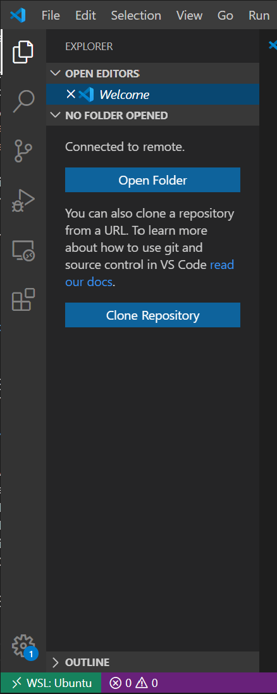

# Setup for Windows

## Windows or WSL?

One important decision to make at the start is to whether or not make Windows your development environment. Generally, python works fine on Windows, so it is perfectly viable for python alone. However, there are a number of python packages for astornomy that are not compatible with Windows. For Code/Astro, all of the packages we will work with work with Windows, but this may not be true for other packages you might encounter for your research.

The suggested alternative is to use Windows Subsystem for Linux (WSL), which is a full Linux operating system running inside of Windows. This is supported by default now on Windows 10 and it is fairly simple to setup. The additional complexity introduced by WSL is that there usually is 1-2 more steps that need to be done to hook up your programming setup to use the python installed under WSL for your development. This is generally not a large barrier, but it involves doing a few extra steps. 

For Code/Astro, we will present instructions on how to set things up for WSL and native Windows. Generally, we will recommend you using WSL for the purpose of software programming for astronomy.

## Windows Subsystem for Linux (WSL)

WSL allows you to run a virtual Linux operating system in Windows. This is officially supported by Microsoft and lets you do anything a Linux user would do. 

### Install WSL

See the WSL installation instructions here: https://docs.microsoft.com/en-us/windows/wsl/install-win10. When you get to the step of choosing a Linux distrbution from the Microsoft store, we suggest you install Ubuntu, as it is probably the easiest to work with. If it is installed successfully, you should be open Ubuntu from the Start Menu and have a black terminal screen appear. Anything you do inside this terminal screen will be done through Ubuntu. But as we will see, this is not the only way to run things in Linux.

### Install xming

Normally, WSL is just a command prompt, so it does not have a GUI interface. If you try to display matplotlib plots through the command line, it will not work, because WSL does not directly talk with your Windows desktop normally. However, you can make this communication happen with xming, which can be installed from here: https://sourceforge.net/projects/xming/.

After you download and install xming, click on it to run. It runs passively in the backgorund, so you should not expect anything to happen. You should just see the xming icon appear in the Windows taskbar. This means the connection is active. 

### Setup Python in Linux

Follow the Linux setup guide to install and configure python for your WSL setup.

### Make your Windows files easily accessible

Be default, WSL starts out in its own specific Linux portion of your filesystem. If you run `pwd` and your username is codeastro, then you will see you start out here (this is your home directory):

    > pwd
    /home/codeastro

We recommend you save your files in the Windows part of your filesystem for easy access with other applications. You can find your main Windows drives (e.g., `C:\`) in the `/mnt/` directory. For example, if my Windows account name is codeastro and it is stored on my `C:\` drive, then I can find my user folder at `/mnt/c/Users/codastro/` when it is normally located at `C:\Users\codeastro\` on regular Windows. If I have a folder called Research in my Documents fodler (located at `C:\Users\codeastro\Documents\Research\`), then I can find it at `/mnt/c/Users/codastro/Documents/Research/`. 

Instead of having to do this complex navigation each time, we recommend using a symbolic link to connect your main work folders to your WSL home directory. FOr example, to link my Research folder in the example above, I can do something like this:

    > ln -s /mnt/c/Users/codastro/Documents/Research/ Research

Now you should have a linked folder called Research. If you `cd` into the folder, you should see the regular contents of that folder. 

## Setup VS Code

For either WSL or native Windows setup, we will use Visual Studio Code as our code editor. You can download it here: https://code.visualstudio.com/. Install the Windows version either way. Follow the general install guide to install the necessary packages and then come back here for specific WSL setup instructions. 

### VS Code for WSL

Normally, the VS Code editor launches in your regular Windows environment. After you install the `Remote - WSL` plugin from the Marketplace, you can connect VS Code to WSL and run programs in the WSL environment. To do this, click on the monitor button on the left panel (highlighted in white below in image below). This button does not exist unless you have installed a package that allows for remote connections such as `Remote - WSL`. Under the "REMOTE EXPLORER" dropdown list, select "WSL Target" if it is not already selected. Then click on the Linux distro you have installed (we recommended Ubuntu) to launch a version of VS Code that is running inside of WSL.

It will take a minute to set up VS Code in WSL, and might ask you a prompt or two (which you will likely need to agree to). Afterwards, it will launch a new VS Code window. This window will be running in WSL. The lefthand side should similar to the screenshot below. At the bottom left corner, you will notice a green status bar indicating you are connected to WSL. 

If you click Open Folder, you can now open up folders and files as if you are in WSL on the command line. Note that extensions for VS Code in WSL is separate from extensions for VS Code on regular Windows, because they are running in separate operating systems. Install extensions in the WSL to use them in WSL. You should now return to the main tutorial to install the necessary extensions and configure python. 